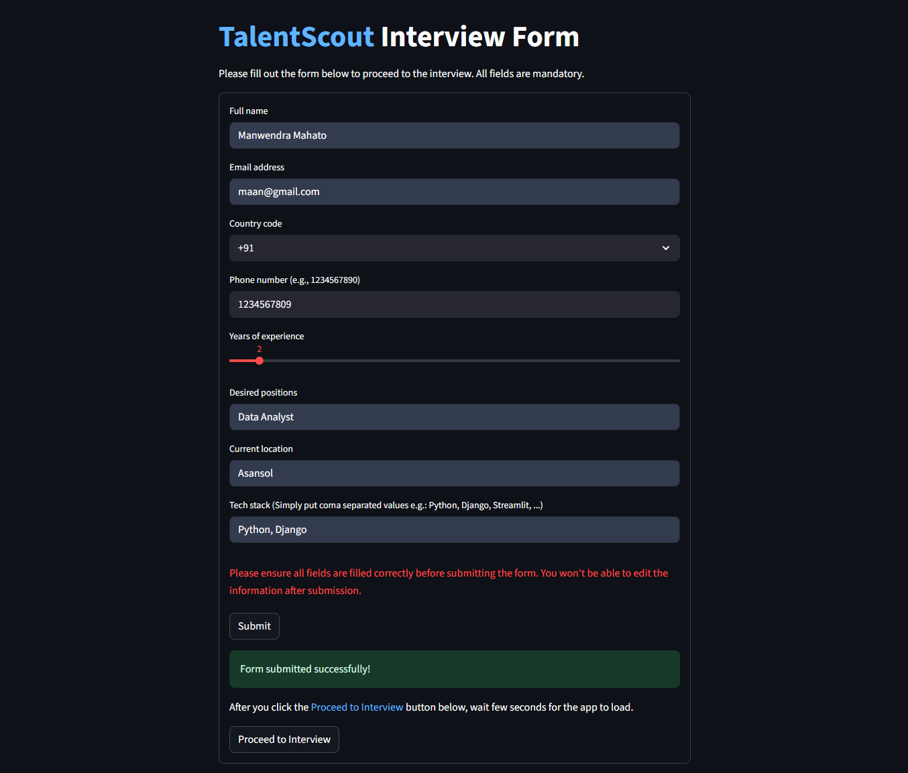
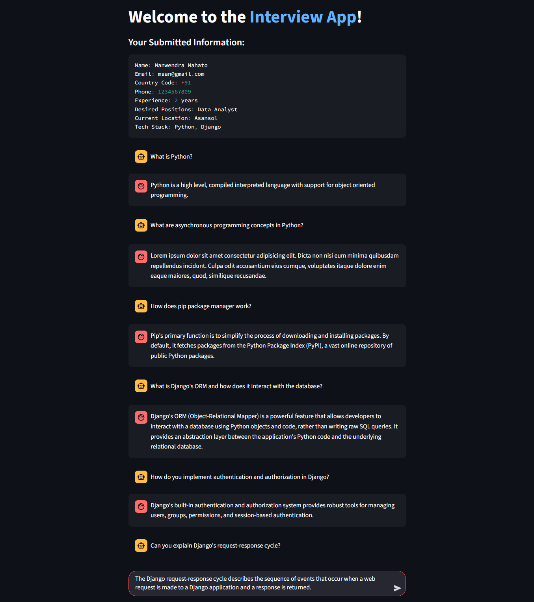
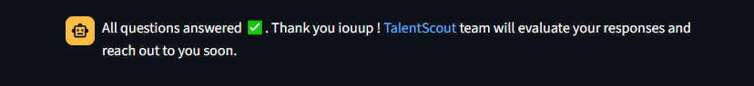

# TalentScout Hiring Assistant Chatbot

## Project Overview

TalentScout Hiring Assistant is an intelligent chatbot designed for initial candidate screening in technology recruitment. Built for the fictional agency "TalentScout," it leverages Large Language Models (LLMs) to collect candidate information and generate tailored technical questions based on the candidate’s declared tech stack. The chatbot streamlines the interview process, ensuring a coherent, context-aware, and user-friendly experience.

---

## Features

- **Greeting & Purpose Overview:** Welcomes candidates and explains the interview process.
- **Candidate Information Gathering:** Collects essential details (name, email, phone, experience, desired position, location, tech stack).
- **Tech Stack Declaration:** Prompts candidates to specify their programming languages, frameworks, databases, and tools.
- **Technical Question Generation:** Dynamically generates 3-5 relevant technical questions for each declared technology.
- **Context Handling:** Maintains chat history and conversation flow for a seamless experience.
- **Fallback Mechanism:** Provides meaningful responses to unexpected or unclear inputs.
- **Conversation Ending:** Gracefully concludes with a thank you and next steps.
- **Data Privacy:** Handles candidate data securely and in compliance with privacy standards.
- **Local Storage:** Simulated data storage for candidate responses.

---
## Project screenshot

1. **TalentScout interview form:**
First the candidates would have to fill the following form.

After clicking on the `Proceed to Interview` button, the Interview agent is loaded

2. **Interview agent:**
The Agent would ask relevant questions based on the candidate's mentioned Tech stack, as shown below. 


3. **Completion message:**
After completion of the Interview by the agent, the following Completion message will be displayed. As soon as this message is displayed, all the candidate details and the interview conversations would be saved for further evaluation.

---
## Installation Instructions

1. **Clone the Repository**
   ```bash
   git clone https://github.com/manwendra-mm/TalentScout-hiring-assistant.git

   cd TalentScout-hiring-assistant
   ```

2. **Install Dependencies**
   ```bash
   pip install -r requirements.txt
   ```

3. **Run the Application**
   ```bash
   streamlit run form.py
   ```

---

## Usage Guide

1. **Start the App:** Launch via Streamlit.
2. **Fill Out the Form:** Enter all required candidate details.
3. **Proceed to Interview:** Click "Proceed to Interview" to start the chatbot session.
4. **Answer Technical Questions:** Respond to questions generated from your tech stack.
5. **Complete Interview:** Receive a thank you message and next steps.

---

## Technical Details

- **Programming Language:** Python
- **Frontend:** Streamlit
- **LLM Integration:** Uses `langchain_ollama` for prompt-based question generation.
- **Prompt Design:** Prompts are crafted to elicit concise candidate information and generate relevant technical questions for each of their mentioned Tech stack.
- **Data Handling:** Candidate responses are stored locally in a simulated file system (`candidate_response/candidate_response.txt`).

---

## Prompt Design

- **Information Gathering:** Prompts are direct and clear, ensuring all required fields are filled before proceeding.
- **Technical Question Generation:** For each tech stack item, the LLM is prompted to generate 3 interview questions in a comma-separated format, ensuring relevance and diversity.
- **Context Management:** Session state is used to maintain chat history and question flow.
- **Fallbacks:** Error messages and guidance are provided for incomplete or invalid inputs.

---

## Data Privacy

- **Simulated Data Storage:** All candidate data is stored locally and anonymized for demonstration.
- **Best Practices:** UTF-8 encoding is used for compatibility with special characters, no sensitive data is shared externally.
- **Compliance:** Designed with GDPR principles in mind; easily adaptable for production-grade privacy requirements.

---

## Challenges & Solutions

- **Prompt Engineering:** Ensured prompts are concise and guide the LLM to produce only the required output.
- **Context Management:** Used Streamlit session state to maintain chat history and question flow.
- **Data Privacy:** Avoided external data storage, used local files for simulation.
- **User Experience:** Provided clear instructions, error handling and a clean UI.

---

## Libraries Used

- `streamlit`
- `langchain_ollama`
- `langchain_core`

---

## Repository Structure

```
TalentScout-hiring-assistant/
├── form.py
├── utils.py
├── candidate_response/
│   └── candidate_response.txt
├── requirements.txt
└── README.md
```

---

## Demo

- **Video Walkthrough:** [YouTube Demo Link](https://youtu.be/MpkXAB_j-KQ?si=sWhp9dNFHErbywoj)
- **Live Demo:** *(Project is not currently deployed, as soon as it's deployed, it would be added here.)*

---

## Optional Enhancements

- **Sentiment Analysis:** Gauge candidate emotions during the interview.
- **Multilingual Support:** Interact in multiple languages.
- **Personalized Responses:** Tailor questions based on user history.
- **UI Improvements:** Custom styling and interactive elements, like adding a progress indicator.
- **Performance Optimization:** Fast response times and efficient handling of multiple users.

---

## Contribution & Version Control

- **Version Control:** Managed via Git with clear commit messages.
- **Contributions:** PRs and issues welcome!

---

## License

This project is for educational purposes and demonstration only.

<!--
---
## Contact

For questions or support, please contact [your.email@example.com](mailto:your.email@example.com).

-->
